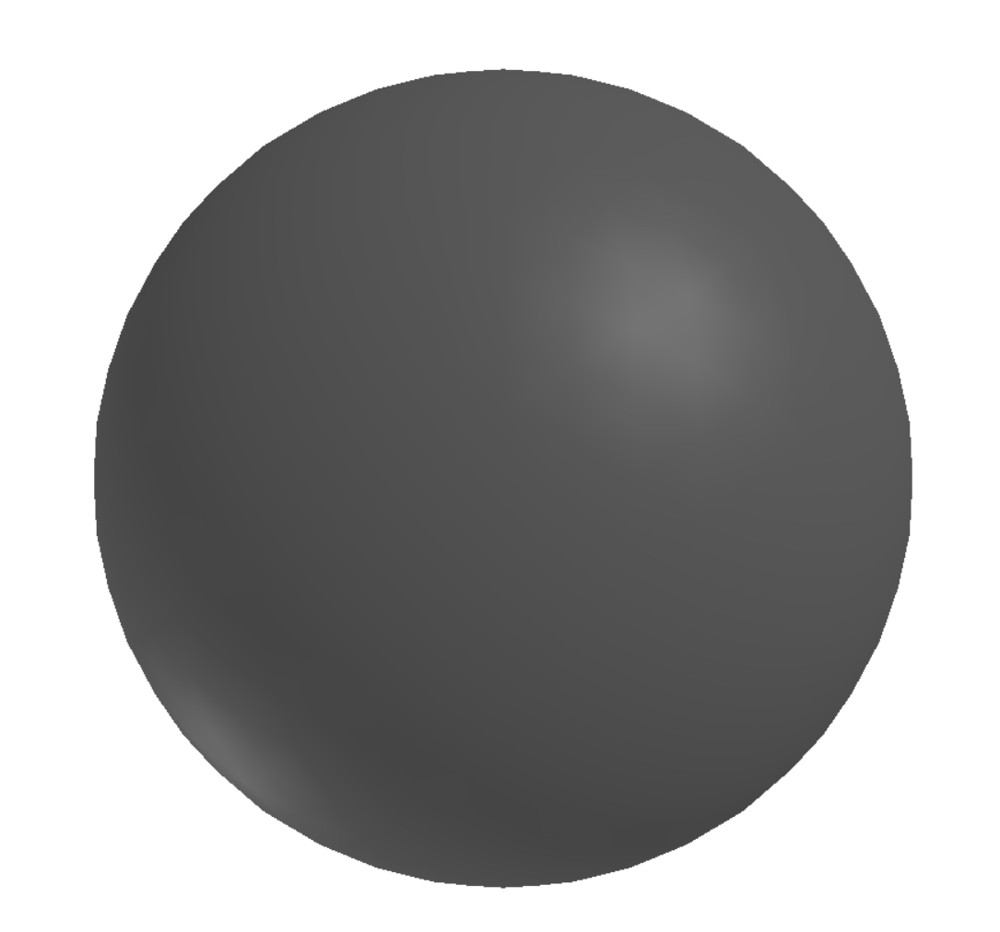

# Generating and classifying 3D shapes

For my starter project I used trimesh to randomly generate meshes of 4 different shapes
(cylinder, cone, annulus, sphere),
with randomized parameters like radius and height. I originally exported these as stl
files, but found that it would be easier to change my data than to create a preprocessor
for making my data work with PointNet.
To make data compatible with PointNet, I generated h5py files with 16 of each shape per file
and 512 points sampled from each shape.

## Results
Accuracy after 50 epochs in PointNet was 93% or so on the testing set. I would like to
debug why evalutate.py is using arrays of size 40 instead of 4 (the original pointnet
	dataset has 40 classes instead of 4). After that, I should be able to see the data that
	was incorrectly classified.
The two classes that had lowest accuracy were cylinder and annulus, which makes sense
because the annulus is just a cylinder with a hole cut through it.

Here are some of the generated shapes:

## References
[Pointnet](https://github.com/charlesq34/pointnet)
